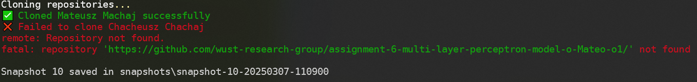
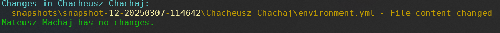
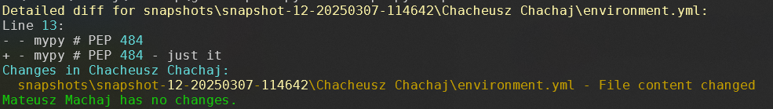

# Git Snapshot Manager

## Overview
Git Snapshot Manager is a tool for managing and comparing Git repository snapshots.

## Requirements
- Python 3
- Git

_NOTE_: **Tool is tested and fully functional just on Windows**

## Installation & Setup

### 1. Prepare the Configuration File
Copy `sample.links.json` to `links.json` and fill it with repository names and URLs:
```json
{
  "First User": "https://github.com/user/repo1.git",
  "Second User": "https://github.com/user/repo2.git"
}
```

### 2. Run the Setup Script

For Windows, use:

```console
gitss.bat
```

For Linux/macOS, use:

```sh
. gitss.sh
```

This will create a virtual environment, install dependencies, and run the tool.


## Features

### Pull:

- Fetches snapshots for a defined collection of repository names and links
- Stores indexed snapshots with timestamps (as `snapshot-<id-number>-<timestamp>`)

### Compare:

- Generates a simple report with repository names and affected files
- Provides a verbose report with line-by-line changes using the `-v` flag
- Supports filtering by a specific repository using `--name "user name"`

## Usage

### 1. Pulling Snapshots

Creates a timestamped snapshot of the defined repositories.

```sh
gitss pull
```

### 2. Comparing Snapshots

Compare two snapshots by their indexed IDs.

### 2.1. Simple Report (Repository Names & Affected Files)

```sh
gitss compare <id_number_1> <id_number_2>
```

### 2.2. Verbose Report (Line-by-Line Changes)

```sh
gitss compare <id_number_1> <id_number_2> -v
```

### 2.3. Report Only for a Selected Repository

```sh
gitss compare <id_number_1> <id_number_2> --name "First User"
```

### 2.4. Get Command Help

```sh
gitss -h
```

## Example Usage

### 1. Get Current Snapshots for Defined Repositories
   
```sh
gitss pull
```

Image:



### 2. Compare Two Snapshots (Simple Report)

```sh
gitss compare 11 12
```

Image:



### 3. Compare Two Snapshots with Detailed Changes

```sh
gitss compare 11 12 -v
```

Image:


